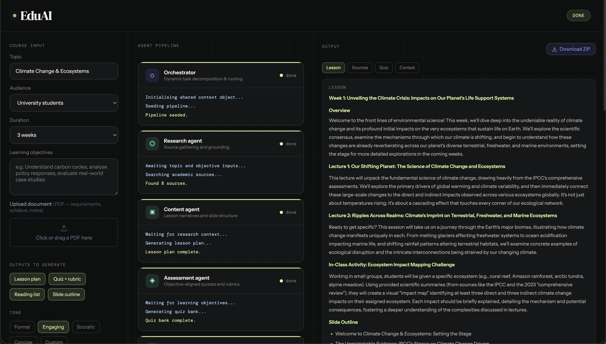

# EduAI Course Builder

A multi-agent AI application that generates complete, research-grounded course packages from teacher-provided inputs. Powered by Gemini and built with FastAPI + Vite.

---



---

## Features

- Multi-agent pipeline: Research → Content → Assessment → Critic → Formatter
- Parallel content and quiz generation
- Real-time agent status via Server-Sent Events
- PDF document upload to ground course content
- Teacher feedback loop with selective agent re-invocation
- Download full course package as a ZIP

## Setup

### Requirements

- Python 3.9+
- Node.js 18+
- A [Google AI Studio](https://aistudio.google.com/apikey) API key

### Install

```bash
# Backend
pip3 install -r backend/requirements.txt

# Frontend
cd frontend && npm install
```

### Configure

Copy `.env.example` to `.env` and add your key:

```
GOOGLE_API_KEY=your_key_here
```

### Run

```bash
./start.sh
```

- Backend: http://localhost:8000
- Frontend: http://localhost:5173
- API docs: http://localhost:8000/docs
